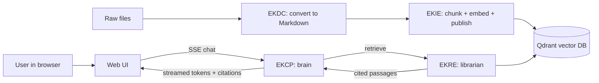

# EK-RAG Help Guide

> Audience: everyone. This is the "what is this and why" document. No prior knowledge assumed.
> Read this before the Installation, User, or Admin guides.

---

## 1. What problem does EK-RAG solve?

Organizations have knowledge scattered across thousands of documents in dozens of formats. When an employee has a question, the answer usually *exists* somewhere — but finding it, trusting it, and getting it in plain language is slow.

A generic AI chatbot cannot help, because it does not know your private documents and it will confidently make things up ("hallucinate"). **EK-RAG** fixes both problems:

1. It **reads your documents** (Retrieval) and
2. **feeds the relevant passages to a language model** (Augmented Generation),
3. so answers are **grounded in your content** and come with **citations** back to the source.

And critically: **everything runs on your own machines.** No document, query, or answer leaves your environment by default. This is what "local-first" and "self-hosted" mean throughout these guides.

---

## 2. The five components in plain English

Think of EK-RAG as an assembly line. Each component does one job and hands off to the next.

### 2.1 EKDC — Enterprise Knowledge Document Converter ("The Translator")

Your documents arrive in every format imaginable: PDFs, Word files, PowerPoints, scanned images, even audio and video recordings. Downstream components only understand **Markdown** (clean, structured text).

**EKDC watches a folder.** Drop any file in, and it automatically produces a Markdown version in an output folder:
- **PDF / Word / PowerPoint / HTML / CSV** → converted with layout, tables, and images preserved.
- **Images (PNG/JPG/…)** → text pulled out with OCR (optical character recognition).
- **Audio (MP3/WAV/…)** → transcribed to text with Whisper.
- **Video (MP4/…)** → audio extracted, then transcribed.
- **Optional AI enrichment** → it can describe images and add file metadata for better search.

EKDC is a **standalone background agent**. It is the only component that is *not* a web service — it is a Python program that runs continuously and reacts to files appearing in a folder.

### 2.2 EKIE — Enterprise Knowledge Ingestion Engine ("The Factory")

EKIE takes the Markdown that EKDC produced and turns it into **searchable knowledge**:
1. **Transform** — normalize the Markdown.
2. **Intelligence** — analyze the document (topics, structure, language).
3. **Chunk** — split it into meaningful, retrievable pieces.
4. **Embed** — convert each chunk into a numeric vector (its "meaning fingerprint").
5. **Publish** — store those vectors in the **vector database (Qdrant)** with mandatory metadata (tenant, classification, source path).

EKIE also records everything in a **control plane** (Microsoft SQL Server) so it has an auditable record of every document, version, and processing step. It exposes a REST API on **port 8001**.

### 2.3 EKRE — Enterprise Knowledge Retrieval Engine ("The Librarian")

When a question comes in, EKRE finds the best supporting passages:
1. **Understand** the query (intent, expansion).
2. **Search** the vector database (semantic) and by keyword.
3. **Fuse** candidates from multiple strategies.
4. **Rank** by relevance and evidence.
5. **Assemble** a citation-preserving package within a token budget and hand it to EKCP.

EKRE guarantees **citation lineage**: every passage it returns carries `document_id`, `chunk_id`, and `source_path`, so answers can always point back to where they came from. It exposes a REST API on **port 8002**.

### 2.4 EKCP — Enterprise Knowledge Chat Platform ("The Brain")

EKCP is where the actual conversation happens:
- **Intent gate** — decides what the user is really asking and whether to route to memory or enterprise knowledge.
- **Memory** — remembers facts and preferences across a conversation.
- **Knowledge** — calls EKRE for supporting passages (with a circuit breaker so a slow EKRE degrades gracefully instead of failing).
- **Model gateway** — talks to the LLM (local Ollama/HuggingFace or another provider behind an abstraction).
- **Streaming chat** — streams the answer token-by-token as Server-Sent Events (SSE) and emits **citation** events for the sources used.
- **Governance** — enforces authentication, per-request security context, role-based access, PII masking, and an audit trail.

EKCP is the **single API gateway** the Web UI talks to. It exposes REST + SSE on **port 8003**.

### 2.5 Web UI — the chat application ("The Face")

A Next.js browser app where users:
- Type questions and watch answers stream in real time.
- See **citation cards** (source path, confidence, classification badge) under each answer.
- Manage multiple conversations (saved locally in the browser).
- Configure their connection (API URL, tenant, user, API key) on a Settings screen.

The Web UI is a **pure client of EKCP** — it never touches a database or another engine directly. It runs on **port 3000** in development.

---

## 3. How a question flows end-to-end

1. You (or EKDC's watched folder) add documents → EKDC converts them to Markdown.
2. EKIE ingests the Markdown → publishes vectors into Qdrant.
3. A user asks a question in the Web UI.
4. The Web UI streams the request to EKCP.
5. EKCP asks EKRE for supporting passages; EKRE searches Qdrant and returns cited knowledge.
6. EKCP grounds the LLM on that knowledge and streams the answer back with citation cards.

---

## 4. Key concepts and glossary

| Term | Meaning |
|---|---|
| **RAG** | Retrieval-Augmented Generation — search your data, then let an LLM answer using it. |
| **Embedding / vector** | A list of numbers that represents the meaning of a chunk of text. Similar meanings → nearby vectors. |
| **Chunk** | A retrievable slice of a document (e.g., a section or paragraph group). |
| **Vector database (Qdrant)** | Stores embeddings and finds the nearest (most similar) ones fast. |
| **Control plane (SQL Server)** | EKIE's system-of-record for documents, versions, lineage, and jobs. |
| **Object storage (MinIO)** | Where EKIE keeps document payloads and intermediate assets. |
| **Citation lineage** | The guarantee that every retrieved passage carries its `document_id`, `chunk_id`, and `source_path`. |
| **Tenant** | An isolation boundary — data for `tenant-a` is never returned to `tenant-b`. |
| **Classification clearance** | Access level: `public` < `internal` < `confidential` < `restricted`. |
| **Security context** | The `{user_id, tenant_id, classification_clearance}` sent with every governed request. |
| **SSE (Server-Sent Events)** | The streaming protocol EKCP uses to push tokens and citations to the browser. |
| **Gateway auth token** | A shared bearer token the Web UI must present to EKCP (`Authorization: Bearer …`). |
| **DSAR / purge** | Data Subject Access Request — the GDPR "delete my data" flow. |
| **Circuit breaker / backpressure** | Resilience: if EKRE is overloaded (HTTP 429) or down, EKCP degrades gracefully instead of failing the chat. |
| **Langfuse** | Self-hosted observability for LLM/agent traces. |
| **Ollama** | A local runtime for LLMs and embedding models (so nothing goes to the cloud). |
| **Contracts** | The shared Pydantic v2 schemas in `packages/contracts` that all engines agree on. |

---

## 5. What you need before you can run anything

Full details are in the [Installation Guide](02-installation-guide.md). At a glance you will need:

- **Docker Desktop** (for Qdrant, Redis, MinIO, Langfuse).
- **Microsoft SQL Server** (Windows-native; EKIE's control plane).
- **Python 3.11+** (for EKIE/EKRE/EKCP) and a separate **Python 3.10+** environment for EKDC.
- **Node.js 20+** (for the Web UI).
- **Ollama** (optional, for local LLM + embeddings).
- For EKDC only: **Tesseract** (OCR), **FFmpeg** (audio/video), **LibreOffice** (complex Word files).

---

## 6. Frequently asked questions

**Q: Does any of my data go to the cloud?**
No, not by default. Every component is self-hosted. The only outbound traffic is optional first-time **model downloads** (from HuggingFace/OpenAI CDNs). After you populate the model cache you can switch EKDC to fully offline mode, and the engines can run against local Ollama models.

**Q: Do I have to run all five components?**
The minimum working chat needs **EKCP + Web UI**. To answer from your documents you also need **EKRE + Qdrant** and documents that **EKIE** has ingested. **EKDC** is only needed if your source documents are not already Markdown.

**Q: Can EKCP answer without EKRE?**
Yes — if knowledge retrieval is disabled or EKRE is unavailable, EKCP degrades gracefully and answers conversationally (without citations). This is by design.

**Q: Is this production-ready?**
The application logic is complete and tested. However, the *operational packaging* has gaps (services are started by running Python scripts by hand; there are no container images or process managers for the engines yet). The honest, detailed assessment and the recommended production hardening are in the [Deployment & Cleanup Guide](05-deployment-and-cleanup-guide.md).

**Q: Where are the secrets configured?**
In per-service `.env` files (see the [Admin Guide](04-admin-guide.md)). Note that a development `.env` with real Langfuse keys is currently committed at the repo root — the Admin and Deployment guides explain why that must be removed and rotated before any real deployment.

---

## 7. Troubleshooting quick reference

| Symptom | Likely cause | Where to look |
|---|---|---|
| Web UI says "Configuration required" | Tenant / API key / User not set | Web UI **Settings** screen — see [User Guide](03-user-guide.md) |
| Web UI shows "Offline" on the home page | EKCP not running or wrong URL | Start EKCP (port 8003); check `NEXT_PUBLIC_EKCP_URL` |
| Chat returns 401 | Missing/incorrect gateway token | Set the same token in EKCP `.env` and the Web UI Settings |
| Chat returns 403 | Security context invalid or tenant mismatch | Ensure tenant/user/clearance are set and tenant matches |
| Answers have no citations | Knowledge disabled, EKRE down, or no documents ingested | Enable `EKCP_KNOWLEDGE__ENABLED`, start EKRE, ingest documents |
| EKDC converts nothing | Wrong `INPUT_DIRECTORY`, or Tesseract/FFmpeg missing | Check `services/ekdc/.env` and prerequisites |
| Web UI and Langfuse both want port 3000 | Port conflict | Run the Web UI on 3001 (`npm run dev -- --port 3001`) |
| EKRE first query is very slow | Loading a HuggingFace embedding model | Expected on first call; use local hash embedder for dev |

More component-specific troubleshooting lives in each engine's Help Guide (linked from the [guides index](README.md)).
