# Enterprise Knowledge RAG System (EK-RAG)
## Master Architecture Blueprint

> **Version:** 2.0
> **Status:** Delivered — Reference implementation built and integration-verified (GO)
> **Owner:** Principal Architect
> **Scope:** End-to-End Product & System Design (EKDC, EKIE, EKRE, EKCP, Web UI)
> **Audience:** Executives, product stakeholders, architects, and engineers. This document is designed to explain the **entire product** on its own — visuals first.

---

## 1. Product Introduction

### 1.1 What EK-RAG Is
**EK-RAG turns an organization's scattered documents into a trustworthy, conversational expert — running entirely on infrastructure the organization controls.**

Employees ask questions in plain language and receive grounded, **cited** answers drawn from the company's own knowledge (policies, handbooks, SOPs, wikis, reports). Every answer carries its sources, respects the asker's security clearance, and never leaves the local environment.

### 1.2 The Problem We Solve
| Enterprise pain | EK-RAG answer |
|---|---|
| Knowledge is trapped across SharePoint, Confluence, PDFs, decks, and spreadsheets | A converter + ingestion pipeline unifies **any** format into searchable knowledge |
| Generic AI chatbots hallucinate and can't cite | Every answer is **grounded and citation-governed** — "if it can't be cited, it isn't generated" |
| Sensitive data can't be sent to cloud LLMs | **Local-first by default** — models, vectors, and data stay on-premises |
| One person's clearance shouldn't expose another's data | **Clearance-aware retrieval** filters at the database boundary before ranking |
| Compliance needs deletion, audit, and PII control | Built-in **DSAR purge, audit trails, and PII masking** |

### 1.3 Who It Is For (Personas)
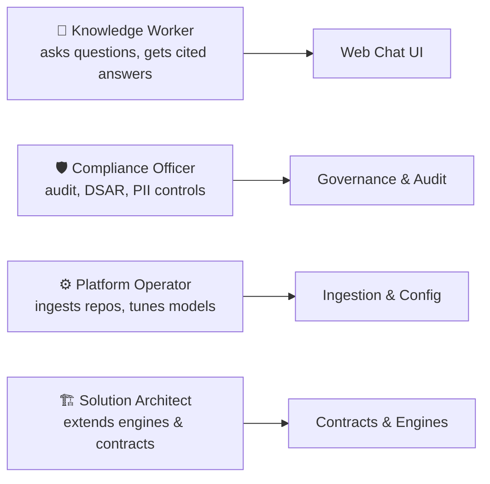

### 1.4 Product Pillars (Brand Promise)
1. **Grounded & Cited** — answers trace back to real source documents.
2. **Private by Default** — self-hosted stack; enterprise data never leaves the environment.
3. **Governed** — clearance, audit, masking, and DSAR purge are first-class, not bolt-ons.
4. **Decoupled & Scalable** — four independent engines scale, fail, and evolve on their own.
5. **Technology-Independent** — model/vendor choices sit behind engine-owned abstractions.

### 1.5 What Makes It Different
Unlike a monolithic "chatbot + search," EK-RAG is a strictly decoupled **pipeline of specialized engines**. Ingestion, retrieval, and chat orchestration each own their data and never reach into each other — they collaborate only through versioned REST contracts and events. This is what makes the platform enterprise-grade: any stage can scale or be replaced without destabilizing the rest.

---

## 2. The Product at a Glance

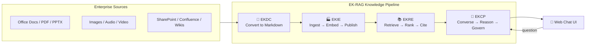

**Four stages, one promise:** raw files become clean knowledge (EKDC), knowledge becomes searchable vectors (EKIE), a question becomes ranked, cited evidence (EKRE), and evidence becomes a governed, conversational answer (EKCP) — presented in a streaming web chat.

---

## 3. The Four Engines (and One Converter)

| Stage | Engine | Role (metaphor) | Owns | Delivers |
|---|---|---|---|---|
| 0 | **EKDC** — Enterprise Knowledge **Document Converter** | The translator | File watcher, format converters | Clean, structured **Markdown** (+ extracted images, OCR, transcripts) |
| 1 | **EKIE** — Enterprise Knowledge **Ingestion Engine** | The factory | Control plane (MSSQL), object storage, vector publishing | Versioned **vectors + metadata** in Qdrant |
| 2 | **EKRE** — Enterprise Knowledge **Retrieval Engine** | The librarian | Query intelligence, hybrid search, ranking | A **RetrievalContextPackage** (ranked, cited, clearance-filtered) |
| 3 | **EKCP** — Enterprise Knowledge **Chat Platform** | The brain | Conversation memory, agents, model gateway, governance | A **governed, streamed answer** with citations |
| UI | **Web Chat UI** | The face | Presentation only | Streaming chat, citation cards, sessions |

> **Decoupling rule:** no engine reads another engine's database, cache, or memory. All collaboration is via REST APIs, events, and shared contracts in `packages/contracts`.

---

## 4. End-to-End System Topology

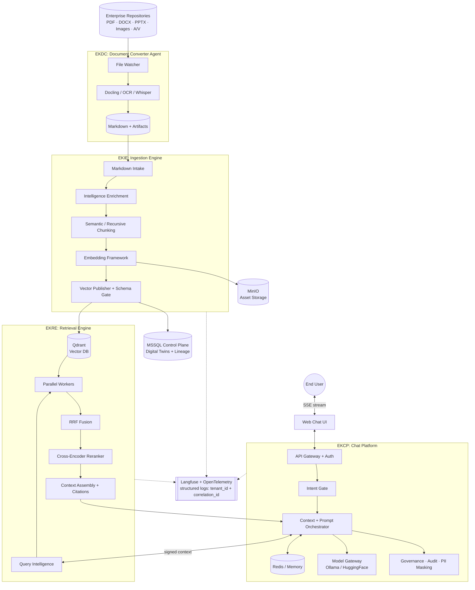

---

## 5. The User Journey — From Question to Cited Answer

This sequence shows exactly what happens when a knowledge worker asks a question. It is the single most important flow to understand the product.

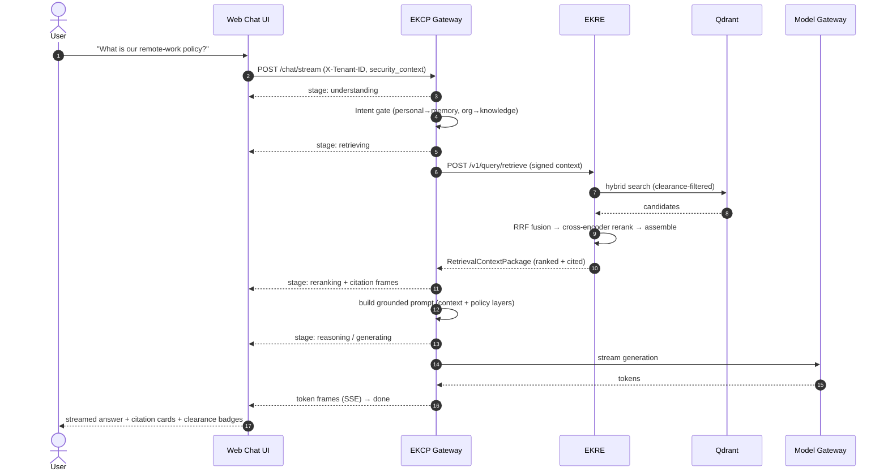

**Key guarantees along this path:**
- The `security_context` is injected on every hop and **signed** (JWT/HMAC) between EKCP and EKRE.
- Retrieval filters by clearance **at the Qdrant boundary**, before ranking.
- Citations are preserved end-to-end; PII is masked before the answer is finalized.
- If EKRE is slow or returns `429`, EKCP **degrades gracefully** to memory (circuit breaker) rather than failing the chat.

---

## 6. The Knowledge Data Lifecycle

Every document flows through a deterministic, versioned, lineage-tracked pipeline. Each arrow is an auditable transformation.

```mermaid
flowchart LR
    A[Raw File<br/>docx/pdf/png/mp4] -->|EKDC convert| B[Markdown +<br/>images/OCR/transcript]
    B -->|EKIE transform| C[Normalized<br/>Markdown Asset]
    C -->|enrich| D[Intelligence<br/>topics/sections]
    D -->|chunk| E[Semantic Chunks]
    E -->|embed| F[Vectors<br/>bge embeddings]
    F -->|publish| G[(Qdrant points +<br/>governed metadata)]
    G -->|EKRE query| H[Ranked, Cited<br/>Context Package]
    H -->|EKCP ground| I[Governed Answer<br/>+ Citations]
```

**Lineage & versioning:** EKIE records each asset (`MARKDOWN → INTELLIGENCE → CHUNKS → EMBEDDING → VECTOR`) in the MSSQL control plane with parent links (`derived_from_markdown`, `chunked_from_intelligence`, `embedded_from_chunks`, `published_from_embedding`). Content-hash idempotency means re-runs never duplicate work, and a workflow orchestrator (LangGraph) can resume from the last completed stage.

---

## 7. Deep Dive: EKDC (Document Converter)

> **New in v2.0.** EKDC is the upstream translator that makes EKIE markdown-only and dramatically simplifies ingestion.

EKDC is a **standalone background agent** (`services/ekdc/`) that watches ingestion folders and mirrors every input file into clean Markdown.

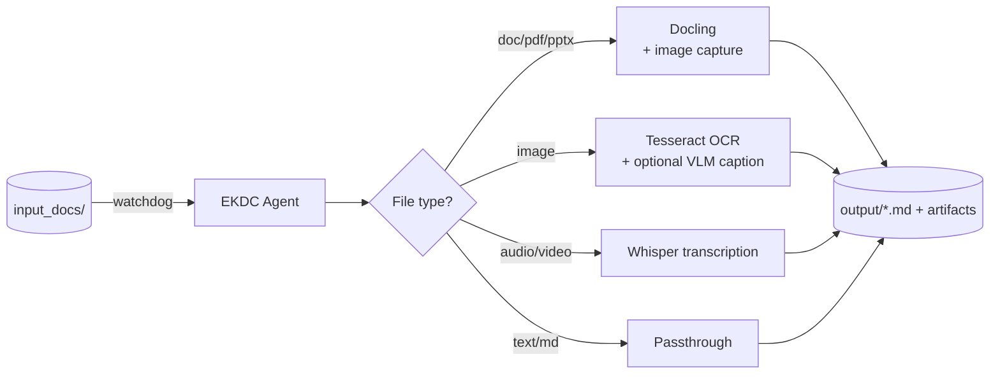

- **Universal format support:** PDF, DOCX, PPTX, HTML, CSV, images, audio, and video → Markdown.
- **Zero-loss images:** embedded and standalone images are carried into Markdown as referenced artifacts (`EKDC_DOCLING_IMAGE_MODE`).
- **Optional multimodal enrichment:** a vision model (Ollama `qwen2.5vl` or HuggingFace `Qwen2.5-VL`) can describe images so their meaning is searchable — **opt-in, OFF by default** (no GPU required to run the core).
- **Local-first & offline-safe:** `EKDC_OFFLINE` hard-blocks model downloads; OCR uses local Tesseract (no external CDN); a per-document description cache and full lifecycle (create/modify/delete/regenerate) keep outputs in sync.
- **Security-hardened:** file-size DoS guard, symlink/path-traversal protection, feedback-loop guards, and secure-by-default remote-code flags.

---

## 8. Deep Dive: EKIE (Ingestion Engine)

EKIE is an asynchronous, event-driven pipeline that treats documents as living **Digital Twins**.

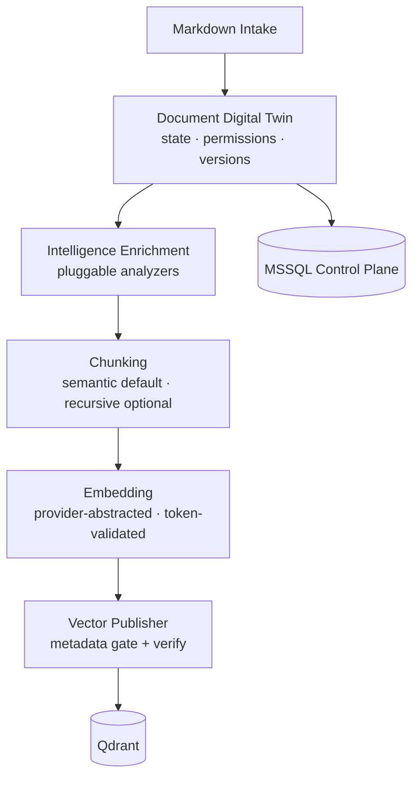

- **Document Digital Twin:** tracks state, permissions, and embedding versions; source changes trigger re-embedding.
- **Intelligent chunking:** structural, section-aware chunking (headers, tables, code kept intact); recursive chunking available as an opt-in strategy.
- **Embedding framework:** provider-abstracted (local deterministic default; HuggingFace `BAAI/bge` default and Ollama behind lazy seams); strict token validation and per-vector integrity checks; optional per-minute rate limiting.
- **Vector publishing & schema gate:** enforces the **Vector Collection Schema** — every point carries `document_id`, `chunk_id`, `tenant_id`, `classification_clearance`, `distance_metric`, `embedding_model`, `embedding_version`, `source_path`, and chunk `content`. Read-back verification confirms what was written.
- **Orchestration:** a LangGraph workflow runner with checkpoints, bounded retries, dead-letter handling, and idempotent resume.
- **Enterprise controls:** RBAC/ABAC per stage, classification propagation (no silent downgrades), secret redaction in logs, plugin SDK with signature/sandbox validation, and a `POST /v1/documents/purge` DSAR path.

---

## 9. Deep Dive: EKRE (Retrieval Engine)

EKRE is the stateless engine that bridges natural-language questions and vector mathematics. It **inherits** the embedding model and distance metric from EKIE — never hardcoding them (the "sameness rule").

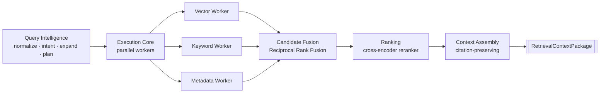

- **Query intelligence:** deterministic normalization, intent classification, enterprise-term/synonym expansion, and plan generation (which engines to run, timeouts, ranking strategy).
- **Parallel execution:** failure-isolating workers run concurrently with admission control and per-task timeouts.
- **Security-first retrieval:** clearance filtering happens **at the Qdrant boundary** (nested `metadata.classification_clearance` + `tenant_id`), with defense-in-depth post-filtering. Cross-tenant isolation is enforced.
- **Fusion & ranking:** Reciprocal Rank Fusion unifies workers; a **cross-encoder reranker** (`bge-reranker`) provides evidence-weighted, auditable ordering with graceful fallback.
- **Citation lineage guarantee:** `source_path` and `document_id` are never dropped through fusion, ranking, or assembly.
- **Governance & hardening:** end-to-end tracing, audit records, PII masking, per-tenant quotas/circuit breakers, signed security-context verification (JWT/HMAC, `alg=none` rejected), collection allowlists, and a retrieval-quality harness (Precision@k / Recall@k / MRR / NDCG).

---

## 10. Deep Dive: EKCP (Chat Platform)

EKCP is the orchestration brain: it owns the conversation, decides where to look, commands the model, and enforces policy.

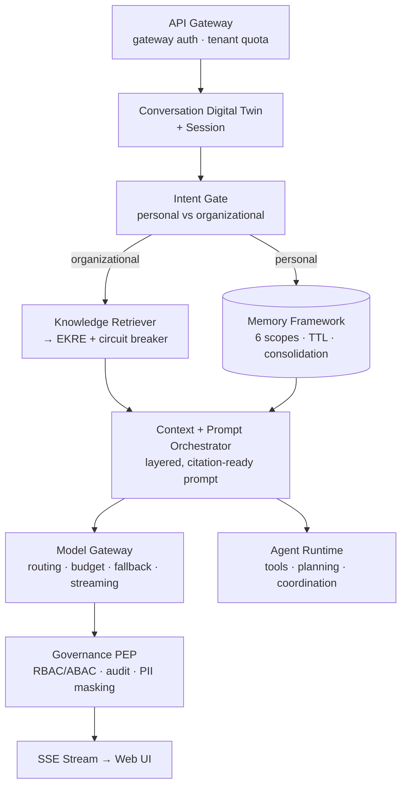

- **Conversation Digital Twin (CDT):** models each conversation as stateful, versioned, and recoverable, with optimistic concurrency.
- **Intent-governed routing:** personal questions hit **memory**; organizational questions route to **EKRE**; mixed queries use both.
- **Memory framework:** six scopes (working → organizational) with TTLs, confidence scoring, consolidation, and DSAR-aware purge.
- **Model gateway:** provider-abstracted (Ollama / HuggingFace), with capability/cost/latency routing, budget ledger, fallback chains, and **real token streaming** (SSE).
- **Agents & tools:** planning, tool execution with permission gating, and multi-agent coordination with approval checkpoints (LangGraph runner optional).
- **Governance PEP:** RBAC/ABAC authorization, classification propagation, audit trails (JSONL file sink), inbound + outbound PII masking, and secret redaction.
- **Resilience:** circuit breaker and graceful degradation to memory when EKRE is unavailable, backpressured (`429`), or times out.
- **Live UX signals:** streams `stage` events (`understanding → retrieving → reranking → reasoning → generating`) and `citation` frames so the UI shows real-time progress and sources.

---

## 11. Web User Interface Layer

The web UI is a **presentation-only** client of the EKCP gateway. It has no direct access to any engine database, vector store, cache, or internal service.

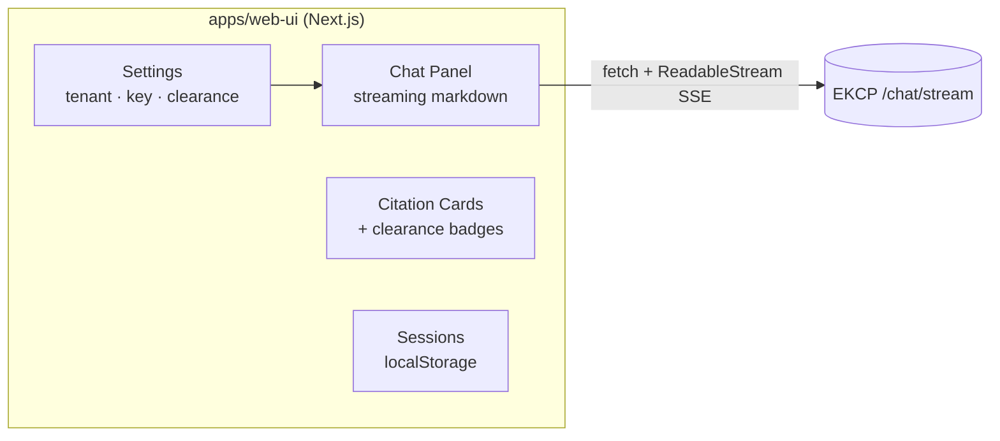

- **Stack:** Next.js (App Router, TypeScript strict), React 19, Tailwind + shadcn/ui.
- **Streaming:** Server-Sent Events consumed via `fetch` + `ReadableStream` (not `EventSource`, which cannot inject headers). Event types: `token`, `citation`, `stage`, `done`, `error`.
- **Tenancy & headers:** every request injects `X-Tenant-ID` and `X-Correlation-ID`; the API key is sent as a Bearer token when configured.
- **Citations UX:** clearance-colored badges (WCAG AA: public/internal/confidential/restricted) and source cards render from `citation` frames.
- **Local-first:** no external analytics, telemetry, CDN, or cloud auth at default configuration; base URL is env-configurable (`NEXT_PUBLIC_*`).
- **Security posture:** upgraded to a current Next.js/React baseline with a 0-known-vulnerability dependency audit and Playwright browser E2E coverage.

---

## 12. Global Enterprise Integration Contracts

The four engines act as one system because they honor these strictly enforced, versioned contracts (owned in `packages/contracts`, Pydantic v2, `extra=forbid`, frozen).

### 12.1 Vector Math & Schema Consistency
EKIE defines embedding dimensionality and distance metric; EKRE **inherits** them at query time. Hardcoding distance metrics in EKRE is prohibited.

### 12.2 Security Context Contract (now signed)
Every EKCP→EKRE request injects a `security_context` (`user_id`, `tenant_id`, `classification_clearance`). It can be cryptographically **signed** (JWT/HMAC) so EKRE derives trust from the token, not from a self-asserted body. EKRE filters candidates at the database boundary before reranking.

### 12.3 Citation Lineage & Explainability
EKIE extracts source paths; EKRE guarantees they survive fusion/ranking/assembly; EKCP validates their presence before generation. **If an answer cannot be cited, it is not generated.**

### 12.4 Cross-System GDPR / DSAR Purge
All engines participate in the `EnterpriseDataPurgeEvent`. On a DSAR, EKCP hard-deletes the Conversation Digital Twin and user memories while EKIE drops the corresponding Document Twins and vectors (`POST /v1/documents/purge`).

### 12.5 Contract Stability & Versioning
Contracts are versioned with backward compatibility preserved for at least one prior version. Breaking changes require architecture approval and a migration plan. No engine forks a local copy of a shared schema.

### 12.6 Contract Reference (canonical shapes)
| Contract | Purpose |
|---|---|
| `SecurityContext` | `user_id`, `tenant_id`, `classification_clearance` on every cross-engine call |
| `VectorCollectionRecord` | Governed metadata written to Qdrant by EKIE |
| `RetrievalCandidate` / `RetrievalContextPackage` | EKRE → EKCP handoff (citation + content + score) |
| `Citation` | `document_id`, `chunk_id`, `source_path` — never dropped |
| `ExecutionContext` | Request/correlation/tenant/session tracing envelope |
| `EnterpriseDataPurgeEvent` | DSAR fan-out across engines |

---

## 13. Cross-Cutting Concerns

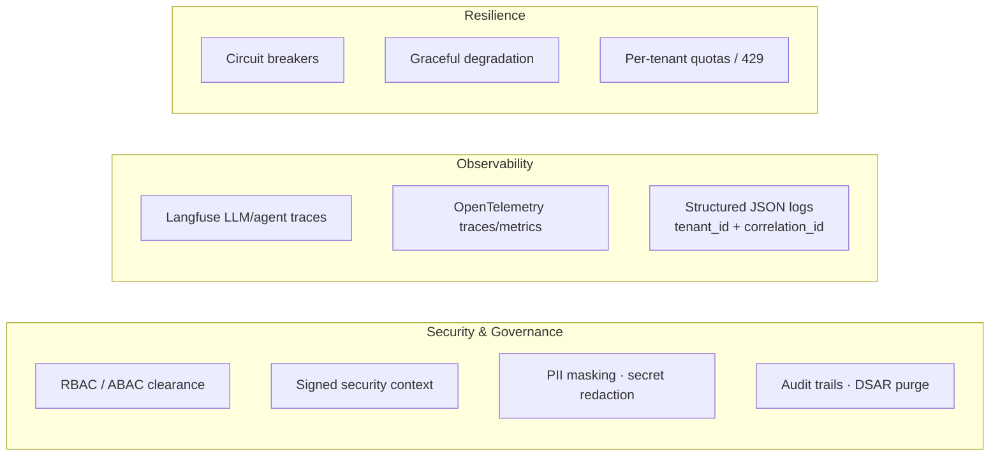

Every request is traceable by `tenant_id` and `correlation_id` from the UI through EKCP, EKRE, and EKIE. Security and resilience are enforced consistently across engines rather than reimplemented ad hoc.

---

## 14. Reference Implementation Stack

The architecture is vendor-neutral by principle (Technology Independence). The current, delivered local-first stack:

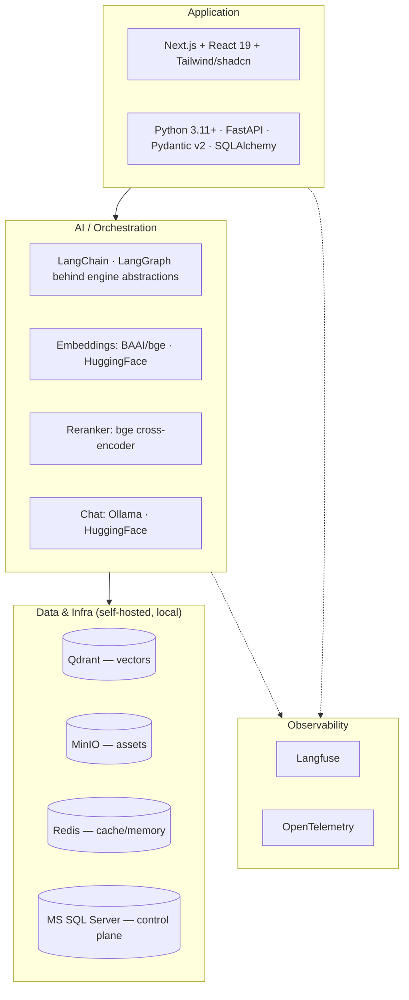

- **Core platform:** Python 3.11+, FastAPI, Pydantic v2, SQLAlchemy. Control plane on Microsoft SQL Server (no PostgreSQL, no cloud).
- **Orchestration & agents:** LangChain and LangGraph, wrapped behind engine-owned abstractions so the core stays model-independent.
- **Models:** deterministic/local providers are the **test/offline default**; real models (`BAAI/bge` embeddings, `bge-reranker` cross-encoder, Ollama/HuggingFace chat) are config-selected behind lazy seams.
- **Data & infra:** Qdrant (vectors), Redis (cache), MinIO (object storage), all self-hosted locally.
- **Observability:** Langfuse (self-hosted) for LLM/agent tracing plus OpenTelemetry; structured JSON logs carry `tenant_id` and `correlation_id`.
- **Local-first & privacy:** all infrastructure is self-hostable and runs locally by default; enterprise data must never leave the environment. Cloud/Kubernetes topologies are optional and deferred to per-engine deployment sprints.

---

## 15. Delivery Status

The reference implementation is **built and integration-verified**. The program shipped foundation-first to preserve contract correctness.

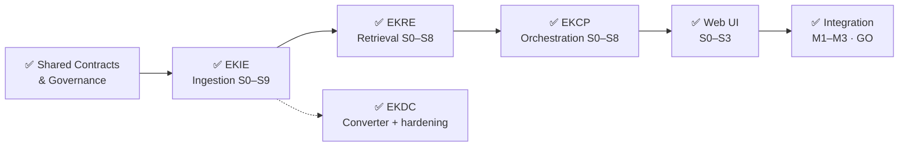

| Track | Status | Highlights |
|---|---|---|
| Shared Contracts & Foundation | ✅ Approved | Versioned Pydantic contracts, request-context schema, policy baseline |
| EKDC (Converter) | ✅ Delivered | Universal→Markdown, image capture, OCR/Whisper, optional VLM, security-hardened |
| EKIE (Ingestion) | ✅ Approved (S0–S9) | Digital twins, chunking, embedding, publishing, orchestration, security, validation |
| EKRE (Retrieval) | ✅ Approved (S0–S8) | Query intelligence → fusion → cross-encoder rerank → cited context, signed-context auth |
| EKCP (Chat Platform) | ✅ Approved (S0–S8) | Conversation, memory, model gateway, agents, governance, streaming, resilience |
| Web UI | ✅ Approved (S0–S3) | Streaming chat, citations, sessions, settings; 0-vuln audit + Playwright E2E |
| Master Integration | ✅ Approved (M1–M3) | Contract matrix, resilience, DSAR purge, readiness, **Go/No-Go = GO** |

### 15.1 Critical Path (historical)
`Contracts → EKIE Publish → EKRE Retrieval + Citation Integrity → EKCP Orchestration → End-to-End Hardening`

### 15.2 Cross-Engine Success Metrics (verified in integration)
- Contract compatibility: 100% across integrated services (fork-free).
- Citation trace completeness: 100% for generated answers.
- Security policy compliance: enforced across retrieval and orchestration flows.
- Release decision: **GO** with all tracked risks resolved or accepted.

---

## 16. Delivery Governance & Change Control

### 16.1 Decision Rights
- **Product Owner:** priority, scope, and business-outcome decisions.
- **Architecture Owner:** cross-engine contract and boundary compliance.
- **Engine Leads:** engine-internal sequencing and implementation design.

### 16.2 Change Rules
- Roadmap changes require documented rationale, dependency impact, and risk impact.
- Breaking contract proposals require an explicit migration plan and phased rollout.
- Cross-engine conflicts are resolved through architecture review before code changes.

### 16.3 Documentation Model
This master architecture is the executive control document. Detailed domain implementation lives in the engine handbooks and guides:
- [EKIE/EKIE-handbook.md](EKIE/EKIE-handbook.md)
- [EKRE/EKRE-handbook.md](EKRE/EKRE-handbook.md)
- [EKCP/EKCP-handbook.md](EKCP/EKCP-handbook.md)
- [Web-UI Deployment Guide](web-ui/Web-UI-Deployment-Guide.md)
- Sprint sequencing in [sprint-plan.md](sprint-plan.md) and [sprints/](sprints/).

---

## 17. Implementation Policy Baseline (Always-On)

Mandatory from day one across all engines:

1. No hardcoded credentials, URLs, ports, thresholds, or magic numbers in business logic.
2. All configurable values live in centralized settings modules backed by environment/config files.
3. Strict type hints for all public and internal interfaces (`mypy --strict`).
4. Pydantic v2 patterns for schema and contract definitions.
5. No bare `except` or broad `Exception` catches except where explicitly justified at boundaries.
6. Structured logging includes `tenant_id` and `correlation_id`.
7. Public classes and methods have concise docstrings; comments explain **why**, not what.
8. Inter-engine payloads use shared models from `packages/contracts`.

Enforced via always-on agent instructions (`.github/copilot-instructions.md`, `.agents/AGENTS.md`), local pre-commit checks, and CI blocking gates for type safety, linting, security, and contract compliance.

---

## 18. Optional Dependencies & Lazy Importing

### 18.1 Principle
EK-RAG engines are fast, lightweight, and deterministic by default. Heavy ML frameworks (`torch`, `transformers`, `langchain-huggingface`, `sentence-transformers`, etc.) are strictly optional and never loaded into the default runtime unless enabled by configuration.

### 18.2 The Seam Pattern
Provider plugins that require large dependencies import them **lazily** inside factory functions (inside `try/except ImportError`). If a feature is enabled but its dependency is missing, the engine raises a domain-specific exception (e.g., `LlmUnavailableError`); if disabled (default), the dependency is never evaluated — preserving fast startup and a lean footprint.

### 18.3 Dependency Management
Each service's inner `requirements.txt` carries only the core deterministic dependencies needed to boot in production. The root-level `requirements.txt` aggregates core **and optional** dependencies for a fully featured local developer environment.

---

*End of Master Architecture Blueprint — v2.0.*
