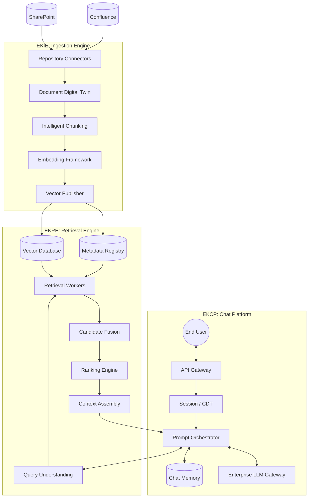

# Enterprise Knowledge RAG System (EK-RAG)
## Master Architecture Blueprint

> **Version:** 1.1
> **Status:** Approved
> **Owner:** Principal Architect
> **Scope:** End-to-End System Design (EKIE, EKRE, EKCP)

---

## 1. Executive Summary

The **Enterprise Knowledge RAG System (EK-RAG)** is a production-grade, highly scalable platform designed to securely ingest, retrieve, and reason over enterprise data. Unlike monolithic AI chatbots, EK-RAG adopts a strictly decoupled **Three-Engine Architecture**. This separation of concerns ensures that ingestion, retrieval, and chat orchestration can scale, fail, and evolve independently without compromising enterprise security or data governance.

### 1.1 The Three Engines
1. **EKIE (Enterprise Knowledge Ingestion Engine):** The factory. Responsible for securely connecting to enterprise repositories, extracting intelligence, chunking, embedding, and publishing vector payloads.
2. **EKRE (Enterprise Knowledge Retrieval Engine):** The librarian. Responsible for understanding user queries, routing them to the right vector/keyword indices, fusing the results, and guaranteeing citation lineage.
3. **EKCP (Enterprise Knowledge Chat Platform):** The brain. Responsible for managing conversational memory, orchestrating agent tools, applying security policies, and generating LLM responses.

---

## 2. End-to-End System Topology



---

## 3. Deep Dive: EKIE (Ingestion Engine)

EKIE is an asynchronous, event-driven pipeline that treats enterprise documents as living entities.

- **Document Digital Twin:** Every file ingested from a repository is modeled as a Digital Twin. This twin tracks the document's state, permissions, and embedding versions. When the source file changes, EKIE updates the twin and triggers a re-embedding pipeline.
- **Intelligent Chunking:** Documents are not blindly sliced by character count. EKIE applies structural chunking (respecting markdown headers, JSON nodes, and code blocks) to maintain semantic integrity.
- **Embedding Framework:** Configurable embedding pipelines (e.g., `text-embedding-3-large`) map chunks into high-dimensional space.
- **Vector Publishing:** EKIE strictly enforces the **Vector Database Collection Schema**, guaranteeing that every vector uploaded contains mandatory metadata (`document_id`, `chunk_id`, `tenant_id`, `classification_clearance`, and `distance_metric`).

---

## 4. Deep Dive: EKRE (Retrieval Engine)

EKRE is the stateless execution engine that bridges the gap between natural language questions and vector mathematics.

- **Query Intelligence Domain:** Before touching the database, EKRE rewrites, expands, and classifies the user's intent. If a user asks "What is the WFH policy?", EKRE expands this to "Work from home, remote work, telecommuting policy."
- **Retrieval Worker Framework:** EKRE fans out execution to multiple workers (Vector, Keyword, Metadata) simultaneously. 
- **Distance Metric Synchronization:** The Vector Worker dynamically queries EKIE's published metadata to ensure it uses the exact same distance metric (Cosine, Dot Product) used during ingestion.
- **Candidate Fusion & Ranking:** Results from different workers are fused using Reciprocal Rank Fusion (RRF) and re-ranked using a cross-encoder model.
- **Citation Lineage Guarantee:** The Context Assembly engine explicitly guarantees that `source_path` and `document_id` are never dropped, ensuring the downstream LLM can cite its sources accurately.

---

## 5. Deep Dive: EKCP (Chat Platform)

EKCP is the orchestration layer that securely interacts with the user, maintains context, and commands the LLM.

- **Conversation Digital Twin (CDT):** Just as EKIE models documents, EKCP models the user's conversation as a stateful Digital Twin, persisting history, extracted facts, and user preferences into long-term memory.
- **Execution Context Package:** EKCP securely bundles the user's query, their RBAC/ABAC security clearance, and the conversation history into a strictly validated package before invoking the LLM.
- **Memory vs. Enterprise Retrieval Governance:** EKCP intelligently routes queries. Personal questions ("What did we talk about?") hit local Memory. Organizational questions ("What is the IT policy?") are routed to EKRE.
- **Cascading Failure Prevention:** If EKRE goes offline or returns an `HTTP 429 Too Many Requests`, EKCP implements exponential backoff and circuit breaking, degrading gracefully to answer from local memory rather than crashing the chat session.

---

## 6. Global Enterprise Integration Contracts

To ensure the three independent engines function as a cohesive system, the following global contracts are strictly enforced across the architecture:

### 6.1 Vector Math & Schema Consistency
- **Rule:** EKIE defines the embedding dimensionality and distance metric. EKRE must dynamically inherit these settings before executing searches. Hardcoding distance metrics in EKRE is prohibited.

### 6.2 The Security Context Contract
- **Rule:** Whenever EKCP requests data from EKRE, it must inject a `security_context` object (containing `user_id`, `tenant_id`, `classification_clearance`). EKRE uses this to filter candidates at the database level *before* reranking.

### 6.3 Citation Lineage & Explainability
- **Rule:** EKIE extracts source file paths. EKRE guarantees these paths survive the reranking pipeline. EKCP validates the presence of these paths before handing context to the LLM. If an answer cannot be cited, it cannot be generated.

### 6.4 Cross-System GDPR & DSAR Purge
- **Rule:** All engines subscribe to the `EnterpriseDataPurgeEvent`. Upon receiving a Data Subject Access Request (DSAR) for a specific `user_id`, EKCP immediately hard-deletes the Conversation Digital Twin, while EKIE simultaneously drops the user's Document Digital Twins and Vector embeddings.

### 6.5 Contract Stability & Versioning
- **Rule:** Cross-engine contracts are versioned and backward compatibility is preserved for at least one previous version.
- **Rule:** Breaking changes require architecture approval and a migration plan before implementation starts.
- **Rule:** Contract definitions are owned in `packages/contracts` and consumed by all engines without local schema forks.

---

## 7. Product Roadmap & Phasing Strategy

This architecture is delivered with a **foundation-first** sequence to reduce integration risk and preserve contract correctness:

1. **Milestone A - Shared Contracts & Governance Rails:** Establish canonical contracts, request context schema, and policy baselines used by all engines.
2. **Milestone B - EKIE Core Ingestion:** Deliver deterministic ingestion, digital twins, chunking, embedding, and vector publication.
3. **Milestone C - EKRE Core Retrieval:** Deliver query intelligence, hybrid retrieval, security filtering, reranking, and citation-preserving context assembly.
4. **Milestone D - EKCP Core Orchestration:** Deliver conversation lifecycle, intent gating, context orchestration, tool-agent execution governance, and response generation.
5. **Milestone E - Integration Hardening & Enterprise Readiness:** Deliver end-to-end quality gates, resilience, scale readiness, and compliance verification.

This milestone model is sprint-cadence agnostic and can be mapped to any team sprint duration.

---

## 8. Execution Dependencies & Critical Path

### 8.1 Sequential Blockers
1. Contract schema freeze in `packages/contracts` must complete before cross-service implementation.
2. EKIE vector publication path must be validated before EKRE retrieval ranking validation.
3. EKRE citation lineage guarantees must be validated before EKCP citation-governed response generation.

### 8.2 Parallelizable Workstreams
- Observability framework scaffolding across all engines.
- CI quality gate design and policy-as-code checks.
- Test harness architecture and synthetic dataset planning.

### 8.3 Critical Path
`Contracts -> EKIE Publish -> EKRE Retrieval + Citation Integrity -> EKCP Orchestration -> End-to-End Hardening`

Any delay on this path delays overall program readiness.

---

## 9. Phase Gates & Success Metrics

### 9.1 Milestone Entry/Exit Gates
- **Milestone A Exit:** Shared contract package reviewed and approved; contract versioning policy ratified.
- **Milestone B Exit:** Deterministic ingest-transform pipeline verified; vector metadata completeness confirmed.
- **Milestone C Exit:** Security filtering and citation lineage preservation verified for retrieval outputs.
- **Milestone D Exit:** Policy-governed orchestration and audit trace completeness verified.
- **Milestone E Exit:** End-to-end contract compatibility, resilience, and operational readiness criteria verified.

### 9.2 Cross-Engine Success Metrics
- Contract compatibility pass rate: 100% across integrated services.
- Citation trace completeness: 100% for generated answers.
- Security policy compliance: 100% for retrieval and orchestration flows.
- Service-level objective adherence: tracked per engine handbook targets.

### 9.3 Go/No-Go Governance
Each milestone requires architecture sign-off, product sign-off, and quality sign-off before progressing.

---

## 10. Delivery Governance & Change Control

### 10.1 Decision Rights
- **Product Owner:** Priority, scope, and business outcome decisions.
- **Architecture Owner:** Cross-engine contract and boundary compliance decisions.
- **Engine Leads:** Engine-internal sequencing and implementation design decisions.

### 10.2 Roadmap Evolution Rules
- Milestone scope changes require documented rationale, dependency impact, and risk impact.
- Breaking contract proposals require explicit migration plan and phased rollout strategy.
- Cross-engine conflicts are resolved through architecture review before code implementation.

### 10.3 Documentation Model
The master architecture acts as an executive control document. Detailed domain implementation remains in engine handbooks:
- `docs/EKIE/EKIE-handbook.md`
- `docs/EKRE/EKRE-handbook.md`
- `docs/EKCP/EKCP-handbook.md`
- Pre-execution sprint and phase sequencing is documented in `docs/sprint-plan.md`.
- Detailed per-engine and master integration sprint tracks are documented in `docs/sprints/`.

---

## 11. Implementation Policy Baseline (Always-On)

The following coding and delivery rules are mandatory from day one across all engines:

1. No hardcoded credentials, URLs, ports, thresholds, or magic numbers in business logic.
2. All configurable values must be defined in centralized settings modules backed by environment or configuration files.
3. Strict type hints are required for all public and internal interfaces.
4. Pydantic v2 patterns are mandatory for schema and contract definitions.
5. Bare `except` and broad `Exception` catches are prohibited except where explicitly justified and reviewed.
6. Structured logging must include `tenant_id` and `correlation_id` for cross-service observability.
7. Public classes and methods require concise docstrings; comments explain why, not what.
8. Inter-engine payloads must use shared models from `packages/contracts`.

These policies are enforced through:
- Always-on agent instructions (`.github/copilot-instructions.md`, `.agents/AGENTS.md`)
- Local pre-commit policy checks
- CI blocking gates for type safety, linting, security, and contract compliance

---

## 12. Reference Implementation Stack (Non-Normative)

The architecture is vendor-neutral by principle (Technology Independence). The following reference implementation is the standard local-first, privacy-preserving stack for EK-RAG and may evolve without changing the normative architecture.

### 12.1 Core Platform
- Language and services: Python 3.11+, FastAPI, Pydantic v2, SQLAlchemy.
- Control plane database: Microsoft SQL Server (enterprise-ready). PostgreSQL is not used as an application database.
- Vector database: Qdrant. Cache: Redis. Object storage: MinIO (self-hosted, local).

### 12.2 Orchestration And Agents
- LangChain and LangGraph, wrapped behind engine-owned abstractions so the core stays model-independent.
- Prompts use ChatPromptTemplate with explicit system and human messages, declared input variables, and partial variables for constants.
- LLMs are constructed through a provider-abstracted factory; output parsing uses LangChain output parsers validated against packages/contracts where payloads cross engines.
- LangChain, LangGraph, and Langfuse conventions are defined in `.github/instructions/langchain.instructions.md`.

### 12.3 Observability
- Langfuse (self-hosted) for LLM and agent tracing plus OpenTelemetry for traces and metrics.
- Structured JSON logging must carry tenant_id and correlation_id.

### 12.4 Local-First And Data Privacy
- All infrastructure is self-hostable and runs locally by default.
- No cloud managed services are used; enterprise data must never leave the local environment.
- Cloud and Kubernetes topologies are deferred to each engine deployment-readiness sprint and remain optional.

### 12.5 Web User Interface
- Framework: Next.js 14+ App Router with TypeScript strict, deployed locally.
- Component library: shadcn/ui with Tailwind CSS.
- Location in monorepo: `apps/web-ui/`.
- Next.js/TypeScript coding conventions are defined in `.github/instructions/nextjs.instructions.md`.

---

## 13. Web User Interface Layer

### 13.1 Scope And Position
The web UI is a consuming REST and SSE client of the EKCP API gateway. It has no direct access to any engine database, vector store, cache, or internal service. All enterprise data flows through the EKCP API boundary only. The UI is a separate application in `apps/web-ui/`; it is not part of any backend service.

### 13.2 Reference Implementation Stack
- Framework: Next.js 14+ App Router with TypeScript strict (`strict: true`).
- Component library: shadcn/ui with Tailwind CSS for enterprise-grade, accessible UI components.
- Location in monorepo: `apps/web-ui/` (standalone Next.js project with its own `package.json`).
- Chat streaming: Server-Sent Events (SSE) from the EKCP `/chat/stream` endpoint consumed via the browser Fetch API with `ReadableStream`. `EventSource` is not used because it cannot inject custom headers.
- Self-hosted Node.js process running locally alongside backend services. No cloud hosting.

### 13.3 Authentication And Tenancy
- API key per tenant, stored in `localStorage` only (no server-side session store at MVP).
- Every HTTP request from the UI injects `X-Tenant-ID` and `X-Correlation-ID` headers.
- The EKCP API gateway is the authentication enforcement point. The UI does not implement auth logic.
- No external identity provider at default configuration.

### 13.4 SSE Streaming Contract
EKCP exposes a streaming chat endpoint (`POST /chat/stream`) that emits Server-Sent Events with four event types:

| Event | Payload | UI action |
|---|---|---|
| `token` | `{"text": "..."}` | Append text to assistant bubble in real time |
| `citation` | `{"source": ..., "confidence": ..., "clearance": ...}` | Buffer for citation cards |
| `done` | `{}` | Finalise response; render citation cards |
| `error` | `{"message": "..."}` | Display error banner; stop stream |

The SSE contract is defined and versioned as part of EKCP-S0-5 (story in the EKCP sprint track).

### 13.5 Data Privacy
- No analytics, telemetry, or error-reporting services that send data outside the local environment.
- All EKCP API calls target `localhost` by default. The base URL is configurable via `.env.local`.
- The web UI has no dependency on any external CDN, managed service, or cloud authentication provider at default configuration.

### 13.6 UI Sprint Dependency Chain
```
EKCP-S0 (SSE contract) → UI-S0 (scaffold + API client)
                              ↓
               EKCP-S3 (model gateway) → UI-S1 (streaming chat)
                                              ↓
                        EKRE exit gate → UI-S2 (citations)
                                              ↓
                        EKCP-S4 (memory) → UI-S3 (sessions)
```

### 13.7 Standards
Next.js/TypeScript coding conventions for `apps/**` are defined in `.github/instructions/nextjs.instructions.md`.

---
*End of Master Architecture Blueprint.*
